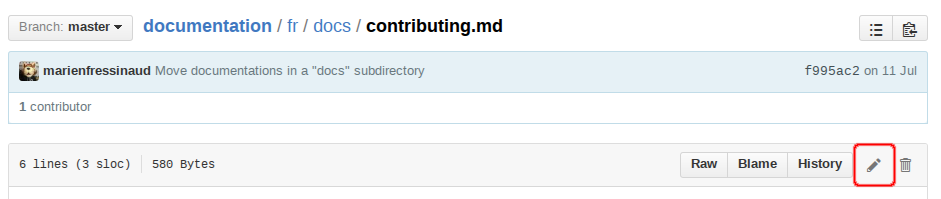

[English version](README.md)

# Documentation de FreshRSS

Ce dépôt contient le code source de la documentation de FreshRSS. Si vous souhaitez simplement la consulter, veuillez vous rendre sur [doc.freshrss.org](http://doc.freshrss.org).

## Comment contribuer ?

La documentation de FreshRSS est aujourd'hui encore trop incomplète. Nous avons besoin d'aide pour la compléter. Si vous souhaitez aider, les points suivants donnent quelques indications sur comment procéder. Si vous souhaitez savoir comment tout ça fonctionne, veuillez vous référer à la partie « Comment ça fonctionne ? ».

La manière facile :

1. rendez-vous sur le fichier que vous souhaitez éditer (par exemple, la page expliquant [comment contribuer à FreshRSS](https://github.com/FreshRSS/documentation/blob/master/fr/docs/contributing.md)) et éditez la page ;

2. faites vos modifications ;
3. validez vos modifications.
4. C'est tout ! Vos améliorations seront probablement discutées puis acceptées. Ensuite, [doc.freshrss.org](http://doc.freshrss.org) sera mis à jour.

La manière plus compliquée :

1. Faites [un fork du projet sur Github](https://github.com/FreshRSS/documentation).
2. Récupérez votre dépôt sur votre ordinateur ou faites les modifications directement sur Github.
3. Le répertoire  ```./fr``` contient la documentation en français.
4. La documentation est écrite en Markdown. La syntaxe est assez intuitive et ne pose généralement pas de problème. Quelques indications [sont données sur Github](https://guides.github.com/features/mastering-markdown/).
5. Faites ensuite une "pull request" sur le dépôt officiel.
6. Vous n'avez rien d'autre à faire ! Vos améliorations seront probablement discutées puis acceptées. Ensuite, [doc.freshrss.org](http://doc.freshrss.org) sera mis à jour.

## Traduire la documentation.

Aujourd'hui, la documentation est écrite principalement en français pour des raisons pratiques. Nous cherchons des personnes prêtes à traduire la documentation vers l'anglais (et éventuellement d'autres langues !). Si vous souhaitez participer, n'hésitez pas à vous manifester sur Github. La démarche est la même que celle décrite dans la partie précédente sauf que vous devrez probablement rédiger dans le répertoire ```./en``` pour l'anglais, ```./es``` pour l'espagnol, etc.

## Comment ça fonctionne ?

La documentation de FreshRSS est générée par [MkDocs](http://www.mkdocs.org/). Il s'agit d'un programme en Python qui génère des sites statiques de documentation.

Ce dépôt ne contient que les fichiers en Markdown, les images et fichiers de configuration (un par langue).

Pour générer le site de documentation à partir des fichiers Markdown, il est nécessaire de suivre un certain nombre d'étapes. Tout d'abord, assurez-vous que Python 2.7+ ainsi que la commande `pip` sont disponibles sur votre PC. Il est conseillé de travailler dans un environnement virtuel (`virtualenv`, `pew` ou similaire).

```bash
$ pip install mkdocs  # Installe MkDocs
$ cd ./fr             # Déplacement dans le répertoire de langue française
$ mkdocs serve        # Donne un aperçu sur http://127.0.0.1:8000
$ # Construit le site et synchronise les fichiers sur un serveur
$ mkdocs build --clean
$ rsync -e ssh -P -rvzc --delete ./site/ user@server:/path/to/server/root/fr
```

Le fichier `index.html` à la racine du dépôt est utilisé en tant que page d'accueil pour gérer l'internationalisation de la documentation car MkDocs ne le gère pas encore.

Nous incluons une version légèrement modifiée du thème readthedocs qui inclut directement les polices d'écriture au lieu d'utiliser les serveurs de Google. Pour utiliser ce thème, vous devez copier le répertoire du thème dans ceux des langues.

```bash
$ cd ./fr
$ cp -R ../readthedocs ./
$ # OU avec un lien symbolique
$ ln -s ../readthedocs ./
```
